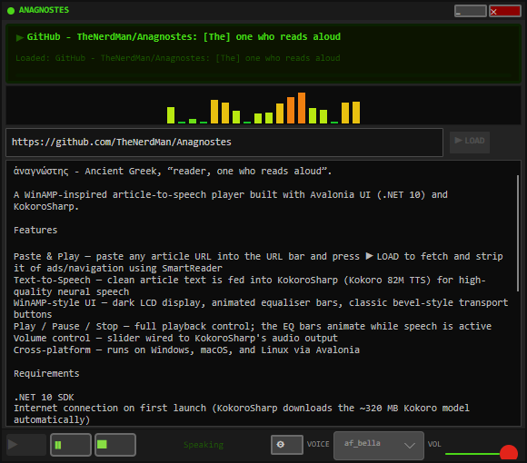

# Anagnostes

> ἀναγνώστης - Ancient Greek, “reader, one who reads aloud”.

A WinAMP-inspired article-to-speech player built with **Avalonia UI** (.NET 10) and **KokoroSharp**.



## Features

- **Paste & Play** — paste any article URL into the URL bar and press **▶ LOAD** to fetch and strip it of ads/navigation using [SmartReader](https://github.com/strumenta/SmartReader)
- **Text-to-Speech** — clean article text is fed into [KokoroSharp](https://github.com/Lyrcaxis/KokoroSharp) (Kokoro 82M TTS) for high-quality neural speech
- **WinAMP-style UI** — dark LCD display, animated equaliser bars, classic bevel-style transport buttons
- **Play / Pause / Stop** — full playback control; the EQ bars animate while speech is active
- **Volume control** — slider wired to KokoroSharp's audio output
- **Cross-platform** — runs on Windows, macOS, and Linux via Avalonia

## Shoutouts
Anagnostes is built on the shoulders of giants, and would not exist without the following open-source projects:
[Avalonia UI](https://github.com/AvaloniaUI/Avalonia)
[KokoroSharp](https://github.com/Lyrcaxis/KokoroSharp)
[Kokoro](https://github.com/hexgrad/kokoro)
[SmartReader](https://github.com/strumenta/SmartReader)

# Developing

## Requirements

- .NET 10 SDK
- Internet connection on first launch (KokoroSharp downloads the ~320 MB Kokoro model automatically)

## Build & Run

```bash
git clone https://github.com/TheNerdMan/Anagnostes.git
cd Anagnostes
dotnet run
```

## How It Works

1. **Article extraction** — `ArticleService` fetches the page with `HttpClient` and passes it through `SmartReader`, which applies a Readability-style algorithm to strip boilerplate (ads, nav, footers) and return the clean article title + body text.
2. **TTS** — `TtsService` wraps `KokoroTTS` (sentence-streaming mode). Each sentence is queued individually so the first words play back almost immediately. Pause/resume use KokoroSharp's built-in audio-player control (`CrossPlatformHelper.GetAudioPlayer().Pause()`).
3. **UI** — `MainViewModel` (INotifyPropertyChanged MVVM) drives the `MainWindow` via compiled Avalonia bindings. The `EqBarsControl` uses a `DispatcherTimer` with spring-physics to animate the bars while speech is active.

## License

MIT — see [LICENSE](LICENSE).
